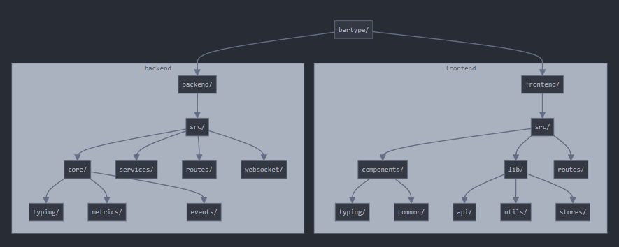
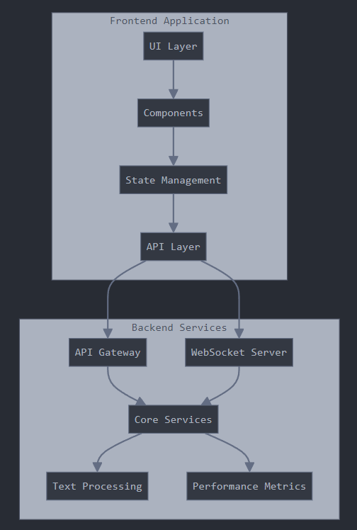

## Directory Structure:

## BARtype System Architecture

The guide will cover:

# Initial Project Setup and Configurations
- Project initialization
- Development environment setup
- Configuration management
- Dependency installation

# Backend Implementation
- Core services implementation
- WebSocket server setup
- API endpoints
- Text processing and metrics calculation

# Frontend Implementation
- SSR configuration
- Component architecture
- State management
- API integration

# Testing & Deployment
- Unit testing strategy
- Integration testing
- Docker configuration
- Deployment workflow